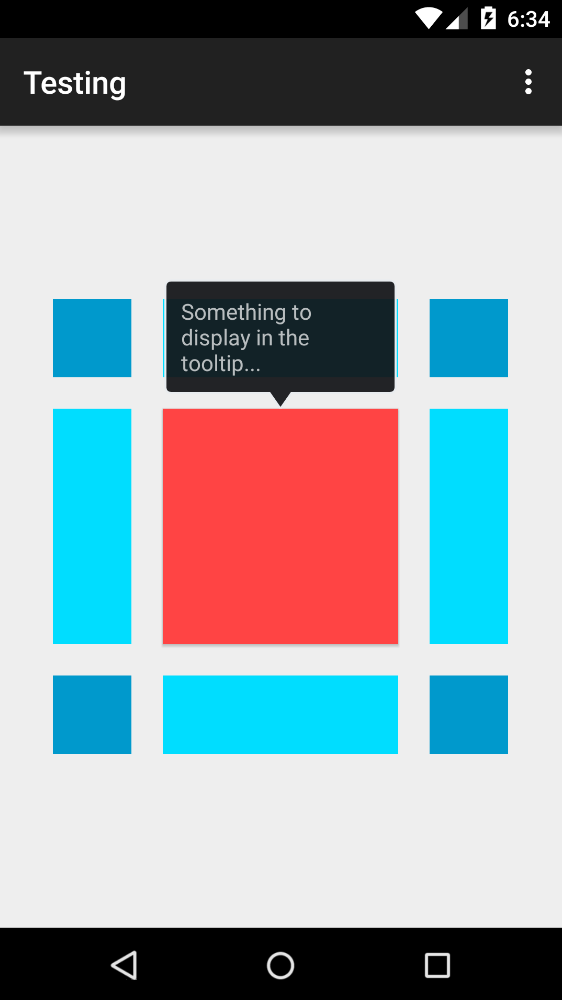
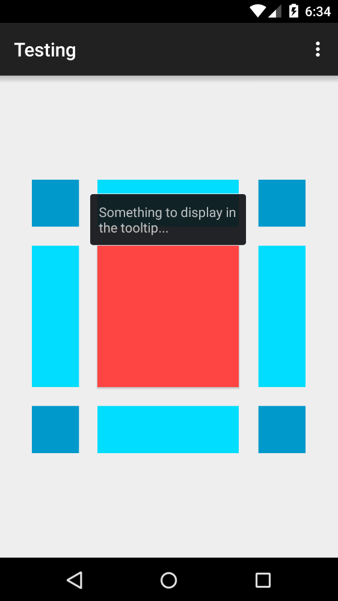

Android Tooltip
======================

Create Toast like tooltips, but targets can be specified, plus custom properties and features

Master: 

Installation
===

	compile('it.sephiroth.android.library.targettooltip:target-tooltip-library:1.2.2@aar'){
        transitive=true
	}

Usage
===

	TooltipManager.getInstance(this)
		.create(MainActivity.TOOLTIP_EDITORIAL_1)
		.anchor(aView, TooltipManager.Gravity.BOTTOM)
		.closePolicy(TooltipManager.ClosePolicy.TouchOutside, 3000)
		.activateDelay(800)
		.text("Something to display in the tooltip...")
		.maxWidth(500)
		.show();

See the inner [Builder][1] class for the complete set of options

Customization
===

Tooltip style can be customized in your style object:

	

then pass the style in the Builder method **withStyleId(int resId)**

Screenshots
===
With Tooltip arrow:

Without Tooltip arrow:

[1]: https://github.com/sephiroth74/android-target-tooltip/blob/master/library/src/main/java/it/sephiroth/android/library/tooltip/TooltipManager.java#L169
