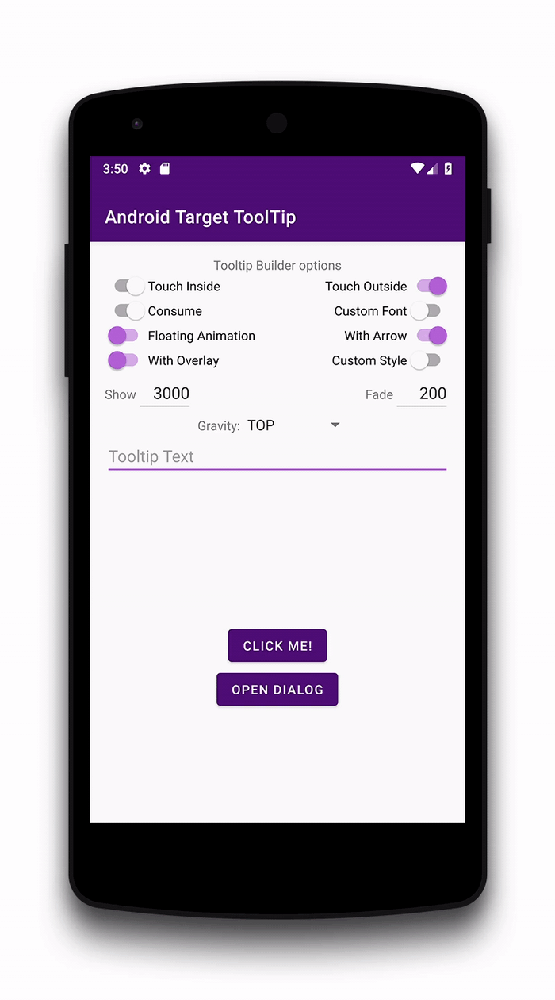

Android Tooltip
======================

Create Toast like tooltips, physical targets can be specified, or even points on screen.
Many additional features and customizations. Just look at the samples Activities.

[](https://travis-ci.org/sephiroth74/android-target-tooltip)

[](https://maven-badges.herokuapp.com/maven-central/it.sephiroth.android.library.targettooltip/target-tooltip-library)
[](https://jitpack.io/#sephiroth74/android-target-tooltip)

Installation
===

## Maven

```gradle
implementation 'it.sephiroth.android.library.targettooltip:target-tooltip-library:**version**'
```	
	
## JitPack

**Step 1.** Add the JitPack repository to your build file:

```gradle
allprojects {
	repositories {
		...
		maven { url 'https://jitpack.io' }
	}
}
```

**Step 2.** Add the dependency

```gradle
dependencies {
        implementation 'com.github.sephiroth74:android-target-tooltip:Tag'
}
```

Get the latest version  on [JitPack](https://jitpack.io/#sephiroth74/android-target-tooltip)	


Usage
===

```kotlin
    val tooltip = Tooltip.Builder(Context)
        .anchor(View, Int, Int, Boolean)
        .anchor(Int, Int)
        .text(CharSequence)
        .styleId(Int)
        .typeface(Typeface)
        .maxWidth(Int)
        .arrow(Boolean)
        .floatingAnimation(Tooltip.Animation)
        .closePolicy(ClosePolicy)
        .showDuration(Long)
        .fadeDuration(Long)
        .overlay(Boolean)
        .create()
    
    tooltip
        .doOnHidden { }
        .doOnFailure { }
        .doOnShown { }
        .show(View, Tooltip.Gravity, Boolean)
```

See the inner [Builder][1] class for the complete set of options

Customization
===

Tooltip style can be customized in your style object:

```xml
    <!-- default style -->
    <declare-styleable name="TooltipLayout">
        <attr name="ttlm_padding" format="dimension" />
        <attr name="ttlm_strokeColor" format="color" />
        <attr name="ttlm_backgroundColor" format="color" />
        <attr name="ttlm_strokeWeight" format="dimension" />
        <attr name="ttlm_cornerRadius" format="dimension" />
        <attr name="ttlm_arrowRatio" format="float" />
        <attr name="android:textAppearance" />
        <attr name="ttlm_overlayStyle" format="reference" />
        <attr name="ttlm_elevation" format="dimension" />

        <!-- font file path inside your assets folder -->
        <attr name="ttlm_font" format="string" />

        <!-- textview text gravity -->
        <attr name="android:gravity" />
    </declare-styleable>
```

And this is the style for the overlay touch:

```xml
    <declare-styleable name="TooltipOverlay">
        <attr name="android:color" />
        <attr name="android:alpha" />
        <attr name="ttlm_repeatCount" format="integer" />
        <attr name="ttlm_duration" format="integer" />
        <attr name="android:layout_margin" />
    </declare-styleable>
```

then pass the style in the Builder method **withStyleId(int resId)**

Screenshots
===



[1]: https://github.com/sephiroth74/android-target-tooltip/blob/master/library/src/main/java/it/sephiroth/android/library/tooltip/Tooltip.java#L1471


License
===
The MIT License

See [LICENSE](LICENSE)
